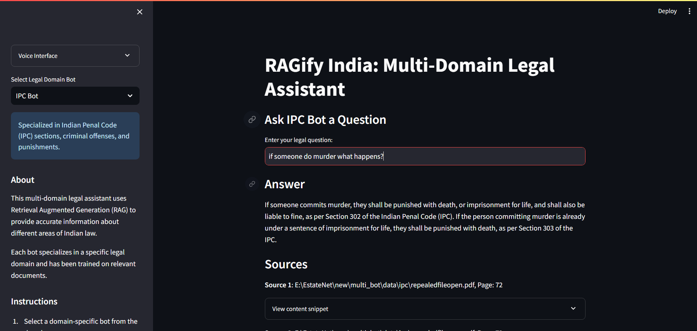

# AI-Powered Legal Assistant


## 🏆 Hackathon Submission

This project was created for [Hackathon Name] to demonstrate how AI can make legal information more accessible to the general public through multiple interaction channels.




DATA - constitution of india , ALL ipc , labour law delhi college book , rti indian court pages

## 📋 Table of Contents

- [Overview](#overview)
- [Key Features](#key-features)
- [Architecture](#architecture)
- [Components](#components)
  - [RAG System](#rag-system)
  - [IVR Phone System](#ivr-phone-system)
  - [WhatsApp Bot](#whatsapp-bot)
- [Technical Innovation](#technical-innovation)
- [Setup Instructions](#setup-instructions)
- [Usage Examples](#usage-examples)
- [Future Development](#future-development)
- [Team](#team)
- [License](#license)

## 🔍 Overview


**Legal Assistant** is a multi-channel legal assistance platform that provides accurate legal information to users through phone calls, WhatsApp, and potentially other channels. Using Retrieval Augmented Generation (RAG) technology, the system accesses a specialized knowledge base of Indian legal documents to provide reliable legal information.

**Problem Statement:** Legal information is often inaccessible to the average citizen due to complex language, limited access to lawyers, and the intimidating nature of legal systems. This particularly impacts those with limited literacy or internet access.

**Our Solution:** EstateNet bridges this gap by allowing users to ask legal questions through familiar channels (phone calls or WhatsApp) and receive accurate, contextual information in simple language.

## 🌟 Key Features

- **Multi-channel support**: Access via phone calls (Exotel IVR) or WhatsApp
- **Specialized Legal Domains**: 
  - RTI (Right to Information)
  - IPC (Indian Penal Code)
  - Labor Laws
  - Constitutional Rights
  - Family Laws
- **Multiple Language Support**: Available in English and Hindi
- **RAG-powered responses**: Retrieves information from vetted legal documents
- **Voice-to-text & text-to-speech**: Allows natural conversation by phone
- **Contextual conversations**: Maintains session context for follow-up questions

## 🏗️ Architecture


This follows a modular microservice architecture:

1. **Front-End Channels**: 
   - IVR system via Exotel
   - WhatsApp via Twilio

2. **Backend Services**:
   - Node.js Express APIs for channel integrations
   - Python FastAPI for the RAG model and vector database operations
   - Session management for context preservation

3. **Data Layer**:
   - Vector database (CHROMADB) for document embeddings
   - Legal document corpus with structured metadata

4. **AI Models**:
   - LLM for generating responses (Google Gemini)
   - Speech-to-text & text-to-speech models
   - Embedding models for vector search

## 🧩 Components

### RAG System

Our Retrieval Augmented Generation system combines vector search with generative AI to produce accurate legal information:

1. **Document Processing Pipeline**:
   - Legal documents are split into chunks
   - Chunks are embedded using embedding models
   - Resulting vectors are stored in a vector database with metadata

2. **Query Processing**:
   - User questions are embedded and used to search the vector DB
   - Relevant document chunks are retrieved
   - Retrieved chunks are used as context for the LLM
   - The LLM generates a contextually accurate response

3. **Legal Domain Specialization**:
   - Each legal domain (RTI, IPC, etc.) has its own specialized index
   - Domain routing ensures questions go to the right knowledge base

### IVR Phone System

Phone-based interaction uses Exotel's platform for a natural voice experience:

1. **Call Flow**:
   - Greeting and domain selection menu
   - Voice recording for question capture
   - Speech-to-text conversion of questions
   - RAG processing and answer generation
   - Text-to-speech conversion for response delivery

2. **Audio Management**:
   - Pre-recorded audio for common prompts
   - Dynamic audio generation for legal responses
   - Proper session management for multi-turn conversations

### WhatsApp Bot

The WhatsApp integration leverages Twilio's API:

1. **Conversation Flow**:
   - Welcome message with legal domain options
   - Natural language question processing
   - RAG-powered answer generation
   - Support for follow-up questions
   - Rich text formatting for clear answers

2. **User Experience Features**:
   - Command system (help, menu, exit)
   - Response splitting for long answers
   - Source citations for legal references
   - Error handling and graceful fallbacks

## 🔬 Technical Innovation

1. **Cross-channel contextual memory**:
   Users can start conversations in one channel and continue in another, with context preserved.

2. **Specialized legal embeddings**:
   Custom trained embedding model optimized for Indian legal terminology.

3. **Hybrid retrieval approach**:
   Combines dense vector search with sparse retrieval methods for improved accuracy.

4. **Legal citation verification**:
   Automated system for verifying legal citations in responses.

5. **Layered RAG architecture**:
   Uses a cascading approach with specialized retrievers for different legal domains.

## 🛠️ Setup Instructions

### Prerequisites

- Node.js (v14+)
- Python (3.8+)
- Twilio account (for WhatsApp)
- Exotel account (for IVR)
- Google API key (for Gemini)

### Installation

1. **Clone the repository**
   ```bash
   git clone https://github.com/yourusername/estatenet.git
   cd estatenet
   ```

2. **Set up the RAG system**
   ```bash
   cd rag
   python -m venv venv
   source venv/bin/activate  # or venv\Scripts\activate on Windows
   pip install -r requirements.txt
   python setup_vector_db.py
   ```

3. **Set up the WhatsApp integration**
   ```bash
   cd whatsapp_example
   npm install
   cp .env.example .env
   # Edit .env with your Twilio credentials
   ```

4. **Set up the IVR system**
   ```bash
   cd callerjs
   npm install
   cp .env.example .env
   # Edit .env with your Exotel credentials
   ```

5. **Start the services**
   ```bash
   # Start RAG API
   cd rag
   uvicorn app:app --host 0.0.0.0 --port 8000
   
   # Start WhatsApp service
   cd whatsapp_example
   npm start
   
   # Start IVR service
   cd callerjs
   npm start
   ```

## 📱 Usage Examples

### WhatsApp Interaction

1. Send "join [sandbox-code]" to the Twilio WhatsApp sandbox number
2. Send "menu" to see available options
3. Select a legal domain by sending the corresponding number (1-4)
4. Ask your legal question in natural language
5. Receive an answer with relevant legal information and sources


### Phone Call Interaction

1. Call the registered Exotel number
2. Listen to the domain selection menu and press the corresponding digit
3. Speak your legal question after the beep
4. Listen to the answer and press 1 for another question or 2 to end the call


## 🚀 Future Development

1. **Additional Channels**: Web interface, and SMS integration
2. **Enhanced Multilingual Support**: Expand language options
3. **Legal Document Upload**: Allow users to upload case documents for analysis
4. **User Authentication**: Enable secure user accounts for tracking legal issues
5. **Lawyer Referral System**: Connect users with legal professionals when needed


## 🛠 Contributors

> Developed with ❤ by Team WeDevBytes from Graphic Era Deemed to Be University.